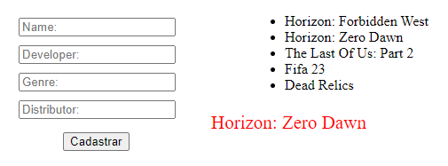

# List Of Popular Games


## Sobre o projeto

<br>

### Layout Web



<br>

## Tecnologias utilizadas

### Front-End
<!-- * HTML / CSS / JS -->

<br>

## Como executar o projeto
```bash
# clonar repositório
git clone git@github.com:maxsueldev/List-Of-Popular-Games.git

# entrar na pasta do projeto e abrir o arquivo index.html
```

<br>

## Autor
Maxsuel Santos

<https://www.linkedin.com/in/maxsuelfernandob/>
